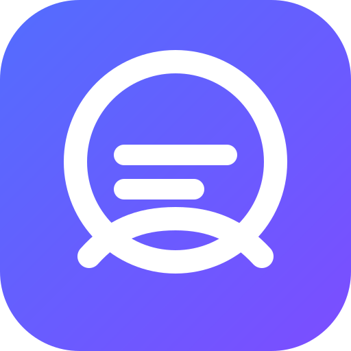

# 🌍 Global Messenger



**Global Messenger** is a free realtime messaging product designed for simple, fast conversations across web, Android, iPhone/iPad, Windows and macOS.

> **Release focus:** realtime reliability, presence accuracy, profile visibility, mobile readiness and a clean user experience.

## ✨ Product features

- 💬 Realtime one-to-one messaging
- 👥 Group conversations
- 🟢 Online/offline presence
- 🕐 Last-seen information when offline
- 👤 Profile photo viewing and management
- 😊 Emoji picker and reactions
- ⌨️ Typing indicators
- 🔔 Notification sounds and incoming-call ringtone
- 📎 Image and file sharing
- ↩️ Message replies
- ✏️ Message editing controls
- 🗑️ Delete for me / delete for everyone
- 🧹 Clear chat
- 💾 Conversation export
- 📞 Voice calls
- 📹 Video calls
- 🎙️ Microphone controls
- 📷 Camera controls
- 🔐 JWT authentication + bcrypt passwords
- 📱 Responsive mobile and desktop UI
- 🤖 Capacitor Android packaging

## 🎯 User experience goals

Global Messenger is intended to be **free for end users**. The interface should stay understandable for a first-time user while remaining useful for people who have many active conversations.

### Welcome experience
- New account: **Welcome to Global Messenger**
- Existing account: **Welcome to Global Messenger — welcome back**
- Time-aware greeting: **Good morning / Good afternoon / Good evening / Good night**
- No misleading online/offline indicator on the login screen

### Profiles
Tap a contact's avatar/name in a conversation to view:
- Profile photo, when available
- Display name
- Username
- Online status
- Last seen information when offline

## 🖼️ Product screenshots

Store screenshots should be captured from a real production build after the two-account QA pass. Recommended screenshots:

| Screen | What it should demonstrate |
|---|---|
| Welcome | Clean first impression and sign-in flow |
| Register | Fast account creation |
| Chats | Multiple active conversations |
| Conversation | Realtime messaging |
| Profile | Photo + online/offline + last seen |
| Group | Group conversation |
| Media | Image/file sharing |
| Calls | Voice/video call UI |
| Mobile | Android/iPhone responsive layout |
| Desktop | Windows/macOS wide layout |

Do not use development URLs, fake statistics, fake reviews or mocked user activity in store assets.

## 🏗️ Architecture

```text
Global Messenger
├── apps/
│   ├── web/          React + TypeScript + Vite + Capacitor
│   └── server/       Fastify API + Socket.IO
├── prisma/           PostgreSQL + Prisma
├── docs/             Development, deployment and store guides
├── .github/
│   └── workflows/   CI workflows
└── package.json
```

## 🧰 Technology stack

- Frontend: React, TypeScript, Vite, Lucide
- Mobile: Capacitor
- Backend: Node.js, Fastify, Socket.IO
- Database: PostgreSQL + Prisma
- Authentication: JWT + bcrypt
- Calls: WebRTC
- Deployment: Docker-compatible hosting

## 🚀 Run locally

### Requirements

- Node.js 22+
- npm
- PostgreSQL or Docker Desktop
- Git

### Install

```bash
git clone https://github.com/Narsing-s/global-messanger.git
cd global-messanger
npm install
npm run db:generate
npm run build
npm run dev
```

Typical local ports:

- Web: `5173`
- API: `4000`

### Health check

```bash
curl http://localhost:4000/health
```

Expected response contains `"ok":true`.

## 📱 Cross-platform release

Global Messenger uses a shared web client so the product can be delivered consistently across:

- Android / Google Play
- iPhone / iPad / App Store
- Windows desktop
- macOS desktop
- Modern browsers

See [`docs/STORE_RELEASE.md`](./docs/STORE_RELEASE.md) for the release path, signing, privacy and store requirements.

## 🧪 Realtime two-account QA

Before calling a release production-ready, test with two independent accounts and preferably two browsers/devices:

1. Login Account A.
2. Login Account B.
3. Confirm A sees B online.
4. Confirm B sees A online.
5. Open several conversations from A.
6. Switch quickly between conversations.
7. Send messages from both accounts at the same time.
8. Confirm no blank/white chat screen appears.
9. Disconnect/reconnect one client.
10. Confirm presence does not incorrectly flip offline while another session is still connected.
11. Confirm the final disconnect marks the user offline.
12. Test profile photo viewing.
13. Test last-seen display after disconnect.
14. Test groups, reactions, replies, files and calls.

## 🛡️ Production requirements

Before public launch:

- HTTPS/WSS everywhere
- Strong production JWT secret
- PostgreSQL backups and restore testing
- Rate limiting and abuse protection
- Safe persistent media storage
- Restricted production CORS
- Error monitoring and structured logs
- Privacy Policy and Terms of Service
- Account/data deletion workflow
- Accurate Google Play Data Safety declaration
- Camera/microphone/notification permission handling
- Production STUN/TURN for reliable calls
- Secure environment variables
- Signed mobile/desktop packages

## 💰 Pricing

**Free for end users.**

Infrastructure, storage and third-party service costs are operational concerns; they must never be presented to users as a mandatory subscription unless the product strategy is intentionally changed later.

## 📚 Documentation

- [`docs/STORE_RELEASE.md`](./docs/STORE_RELEASE.md) — Android, iOS, Windows, macOS and store release plan
- [`docs/01-getting-started.md`](./docs/01-getting-started.md)
- [`docs/02-architecture.md`](./docs/02-architecture.md)
- [`docs/03-features.md`](./docs/03-features.md)
- [`docs/04-testing.md`](./docs/04-testing.md)
- [`docs/05-production-deployment.md`](./docs/05-production-deployment.md)
- [`docs/06-android-play-store.md`](./docs/06-android-play-store.md)
- [`docs/07-release-checklist.md`](./docs/07-release-checklist.md)
- [`docs/08-contributing.md`](./docs/08-contributing.md)

## 🤝 Contributing

Bug reports, feature requests, documentation improvements and pull requests are welcome. Keep changes focused, tested and documented.

## 🌐 Repository

https://github.com/Narsing-s/global-messanger

## 📝 Store copy

### Short description
**Free realtime messaging for everyone — chat, share, react and connect without borders.**

### Long description
**Global Messenger is a free, friendly messaging app built for fast conversations without unnecessary complexity.**

Chat privately or create group conversations, share images and files, see when people are online, and keep conversations moving with realtime delivery. Global Messenger is designed for phones, tablets and desktop users with a responsive experience across platforms.

**Highlights**
- Free messaging
- Private one-to-one conversations
- Group chats
- Realtime online/offline presence
- Profile photos
- Image and file sharing
- Replies and reactions
- Message editing and deletion controls
- Voice and video calling foundation
- Android, iPhone/iPad, Windows and macOS experience

Global Messenger is intended to remain free for end users.
